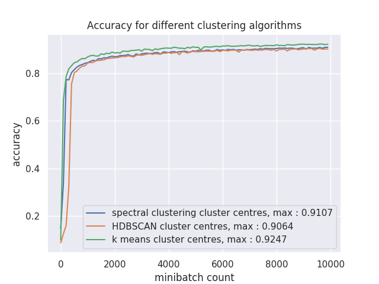
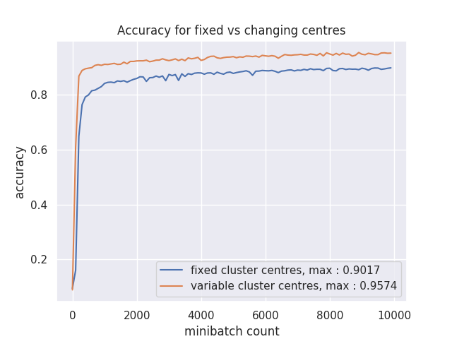

# RBFN

The aim of this project is to do comparative analysis of RBFNs (Radial Basis Function Networks).
Considering two cases : variable cluster centers and different clustering algorithms.

## Effects of clustering algorithms

Comparing three different clustering algorithms for the cluster center finding stage :
- K means 
- Spectral clustering
- HDBSCAN

For each of the algorithm, we try to keep 100 cluster centres.
The best accuracy is obtained by the K Means algorithm. 

## Effects of variable cluster centres

Comparing the effect of variable and fixed cluster centers. 
100 points are randomly selected as the clustr center.

For both the cases, the same set of points are used as cluster centers initially but in variable cluster centers the backpropagated error changes the cluster center.

Variable cluster center significantly outperforms fixed cluster center based RBFNs.

## File structure

All the files are present in *src* directory.

1. *rbfn.py* contains implementation of Radial Basis Function Network and the implementation of trainer.
2. *clustering.py, clustering_hd.py, clustering_spectral.py* are used for clustering points with different algorithms.
3. *compare_clustering_algos.py compare_variable_centres.py* are used for comparing different versions of RBFN.

## Future work 
- [ ] Implement alternative kernels: fractional norms.
- [ ] Try finding reason for relatively poorer performance of other clustering algorithms.